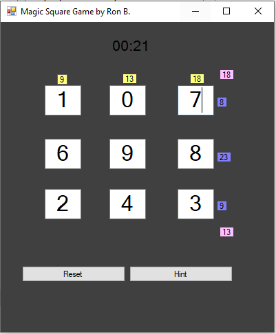

# Magic Squares

This program is a visual application created in C++/CLI. The goal of the Magic Squares is to enter numbers in a 3x3 grid where each number is unique (0-9) and every row, column, and diagonal add up to the same number. Trying to enter the same number multiple times won't result in a victory message. If you're stuck, you can press the hint button to fill in a element of the grid with a number that works for a certain solution (there are several different solutions, mostly mirroring eachother).

# How To Run
To run this program, you must have Microsoft .NET framework 4.5.2. Youcan simply run the .exe in the debug folder or you can build the application yourself through Visual Studio.

